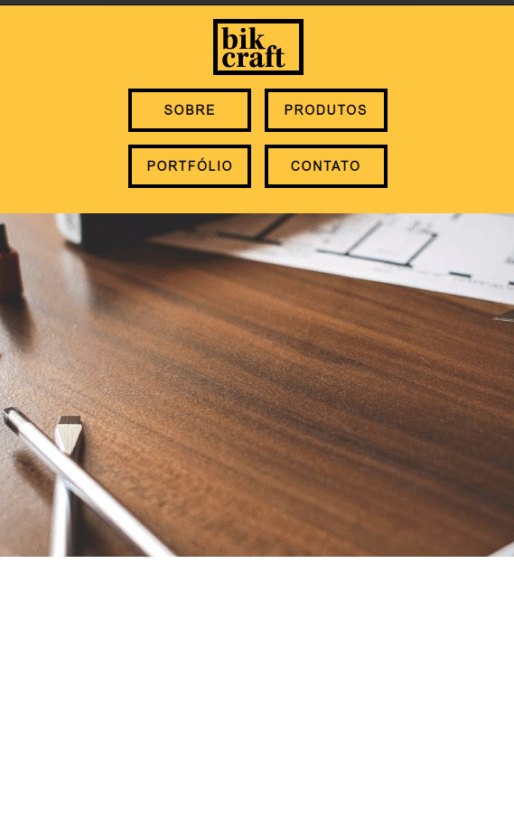

# Web Design Completo

## Sobre

No curso foi desenvolvido um website que se adapta a varias plataformas, como mostradas a cima, utilizando apenas HTML, CSS e o minimo de Javascript pois o objetivo do mesmo é mostra como se utilizar o HTML e CSS.
